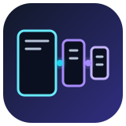
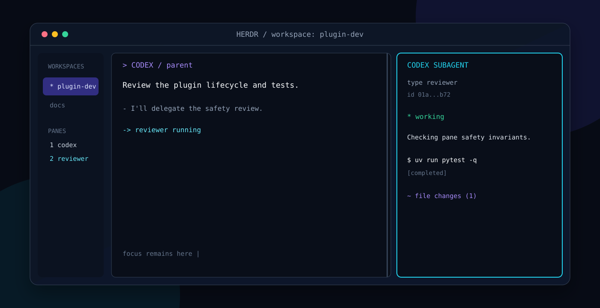
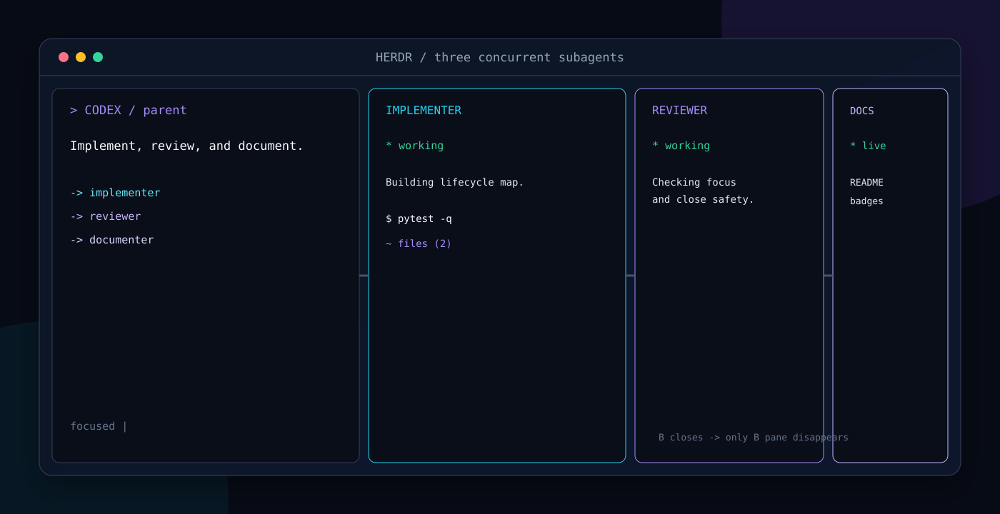

<div align="center">
  
  <h1>Herdr Codex Subagents</h1>
  <p><strong>Every Codex subagent gets a live pane. Every finished pane disappears.</strong></p>
  <p>A tiny, read-only bridge between Codex lifecycle hooks and Herdr layouts.</p>
</div>

<p align="center">
  <a href="https://github.com/arvkonstantin/herdr-codex-subagents/actions/workflows/ci.yml"></a>
  <a href="https://github.com/arvkonstantin/herdr-codex-subagents/actions/workflows/ci.yml"></a>
  <a href="https://github.com/arvkonstantin/herdr-codex-subagents/actions/workflows/codeql.yml"></a>
  <a href="https://github.com/arvkonstantin/herdr-codex-subagents/actions/workflows/dependency-review.yml"></a>
  <a href="https://scorecard.dev/viewer/?uri=github.com/arvkonstantin/herdr-codex-subagents"></a>
  <a href="https://github.com/arvkonstantin/herdr-codex-subagents/releases"></a>
  <a href="LICENSE"></a>
</p>

<p align="center">
  
  
  <a href="https://herdr.dev"></a>
  
  <a href="https://docs.astral.sh/ruff/"></a>
  <a href="https://docs.pytest.org/"></a>
  <a href=".github/dependabot.yml"></a>
  <a href="SECURITY.md"></a>
  <a href="CONTRIBUTING.md"></a>
</p>

<p align="center">
  <a href="https://github.com/arvkonstantin/herdr-codex-subagents/stargazers"></a>
  <a href="https://github.com/arvkonstantin/herdr-codex-subagents/forks"></a>
  <a href="https://github.com/arvkonstantin/herdr-codex-subagents/issues"></a>
  <a href="https://github.com/arvkonstantin/herdr-codex-subagents/pulls"></a>
  <a href="https://github.com/arvkonstantin/herdr-codex-subagents/graphs/contributors"></a>
  
  
  
  
  
  
</p>

<p align="center">
  <a href="#why">Why</a> ·
  <a href="#preview">Preview</a> ·
  <a href="#installation">Installation</a> ·
  <a href="#how-it-works">How it works</a> ·
  <a href="#safety-model">Safety</a> ·
  <a href="#development">Development</a> ·
  <a href="#roadmap">Roadmap</a>
</p>

> [!NOTE]
> This is an independent community project. It is not affiliated with OpenAI or Herdr.

## Why

Codex can run several native subagents concurrently, but their work normally stays inside the
parent agent UI. This plugin turns that invisible fan-out into a spatial, glanceable Herdr layout:

- the first subagent splits the parent pane to the right;
- each additional concurrent subagent splits the newest right-hand pane again;
- every pane streams a compact, read-only view of that subagent's rollout;
- the user's cursor focus never moves;
- the exact pane closes when the matching subagent finishes.

The plugin only activates inside a Herdr-managed pane. Codex Spaces, Agents, desktop/web sessions,
IDE sessions, and ordinary terminals are strict no-ops.

## Preview

### One subagent



### Concurrent fan-out



The previews are faithful illustrations of the layout and viewer output. Exact colors depend on
your terminal theme.

## Highlights

| Capability | Behavior |
| --- | --- |
| Native lifecycle | Uses Codex `SubagentStart` and `SubagentStop` hooks. |
| Stable identity | Maps the exact Codex `agent_id` to the exact Herdr `pane_id`. |
| Background-safe | Targets the parent pane explicitly, even while another Herdr workspace is open. |
| Focus-safe | Every split uses `--no-focus`; viewers never receive input. |
| Concurrent-safe | Serializes state updates with an OS file lock. |
| Crash-aware | Detects terminal rollout events and performs viewer-side fallback cleanup. |
| Session cleanup | Removes tracked viewers on `SessionEnd` and before a new session reuses a pane. |
| Private by default | Reads local rollout files only; no telemetry or network calls. |

## Requirements

- [Herdr](https://herdr.dev) with the `pane split`, `pane run`, and `pane close` CLI commands.
- Codex CLI with lifecycle hooks and native subagents. Tested with Codex CLI `0.153.4`.
- Python `3.10` or newer.
- Linux or macOS. The implementation uses Unix file locking, matching Herdr's current terminal
  environment.

## Installation

Add this repository as a Codex plugin marketplace:

```bash
codex plugin marketplace add arvkonstantin/herdr-codex-subagents
codex plugin add herdr-codex-subagents@herdr-codex-subagents
```

Start a new Codex session inside Herdr. Open `/hooks`, review the four plugin hooks, and trust them.
Codex intentionally requires trust again whenever a hook definition changes.

To test a local checkout instead:

```bash
codex plugin marketplace add /absolute/path/to/herdr-codex-subagents
codex plugin add herdr-codex-subagents@herdr-codex-subagents
```

No Herdr configuration changes are required.

## How it works

```text
SubagentStart(agent A)  -> split parent right       -> parent | A
SubagentStart(agent B)  -> split A right            -> parent | A | B
SubagentStart(agent C)  -> split B right            -> parent | A | B | C
SubagentStop(agent B)   -> close pane mapped to B   -> parent | A | C
SubagentStop(agent C)   -> close pane mapped to C   -> parent | A
SubagentStop(agent A)   -> close pane mapped to A   -> parent
```

The subagent itself remains owned by the original Codex process. A new pane runs a lightweight
viewer, not a second Codex instance. The viewer finds the rollout whose filename ends with the exact
`agent_id`, then renders assistant updates, shell commands, file changes, MCP calls, and terminal
status. It never writes to the rollout.

State lives in Codex's plugin data directory and has this minimal relationship:

```text
Codex session + parent pane
└── agent_id
    ├── pane_id
    ├── agent_type
    └── creation sequence
```

## Safety model

The project treats pane deletion as a destructive operation and enforces these invariants:

1. `HERDR_ENV` must equal `1` and `HERDR_PANE_ID` must be present.
2. The parent pane must resolve through the current Herdr session before a split.
3. New panes are created from explicit IDs with `--no-focus`.
4. Only panes returned by this plugin's own successful split are persisted.
5. Stop cleanup requires an exact `agent_id` match.
6. A pane whose ID equals the parent pane ID is never closed.
7. Hook failures are logged and never block Codex's agent lifecycle.

## Background workspaces

You can switch to another Herdr workspace while Codex is working. The hook inherits the originating
workspace and pane IDs, so it creates viewers beside the parent Codex pane without changing your
current focus. When you return, active viewers are already visible. Viewers for subagents that
finished while you were away have already been removed.

## Configuration

The defaults are intentionally zero-config. One optional environment variable is available:

| Variable | Default | Purpose |
| --- | --- | --- |
| `HERDR_SUBAGENT_CLOSE_GRACE` | `0.35` | Seconds the viewer waits after a terminal rollout event before fallback self-close. |

Codex supplies `PLUGIN_ROOT` and `PLUGIN_DATA`. `CODEX_HOME` is respected when set and otherwise
defaults to `~/.codex`.

## Troubleshooting

- No pane appears: confirm Codex was started inside Herdr and trust the hooks through `/hooks`.
- A viewer says it is waiting: the child rollout is created asynchronously; it should attach as soon
  as Codex persists it.
- A stale viewer remains after a hard process crash: starting a new Codex session in the same parent
  pane cleans tracked viewers from the previous session.
- Hook diagnostics are written to `plugin.log` inside the Codex-provided `PLUGIN_DATA` directory.

Please include Codex and Herdr versions in bug reports, but never attach private rollout files.

## Development

The runtime has no third-party dependencies. Development uses [uv](https://docs.astral.sh/uv/):

```bash
uv sync --extra dev
uv run ruff check .
uv run pytest --cov --cov-report=term-missing
```

The suite uses a fake Herdr client and never touches the developer's active Herdr session. Coverage
must remain at or above 90%.

See [CONTRIBUTING.md](CONTRIBUTING.md) for the contribution workflow and
[SECURITY.md](SECURITY.md) for private vulnerability reporting guidance.

## Roadmap

- Configurable split direction and ratio.
- Optional minimum visibility duration for short-lived subagents.
- Richer rendering for MCP calls and file diffs.
- Recorded terminal demos across common themes.
- Compatibility fixtures for new Codex and Herdr releases.

## Star history

[](https://star-history.com/#arvkonstantin/herdr-codex-subagents&Date)

## Contributing

Issues and pull requests are welcome. By participating, you agree to follow the
[Code of Conduct](CODE_OF_CONDUCT.md).

## License

Released under the [MIT License](LICENSE).
